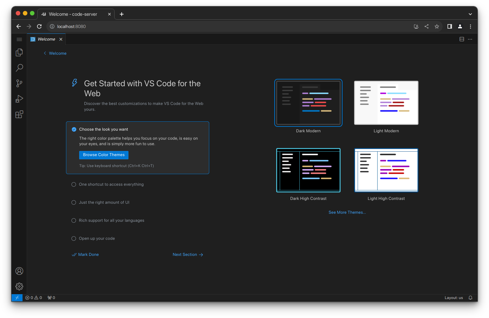
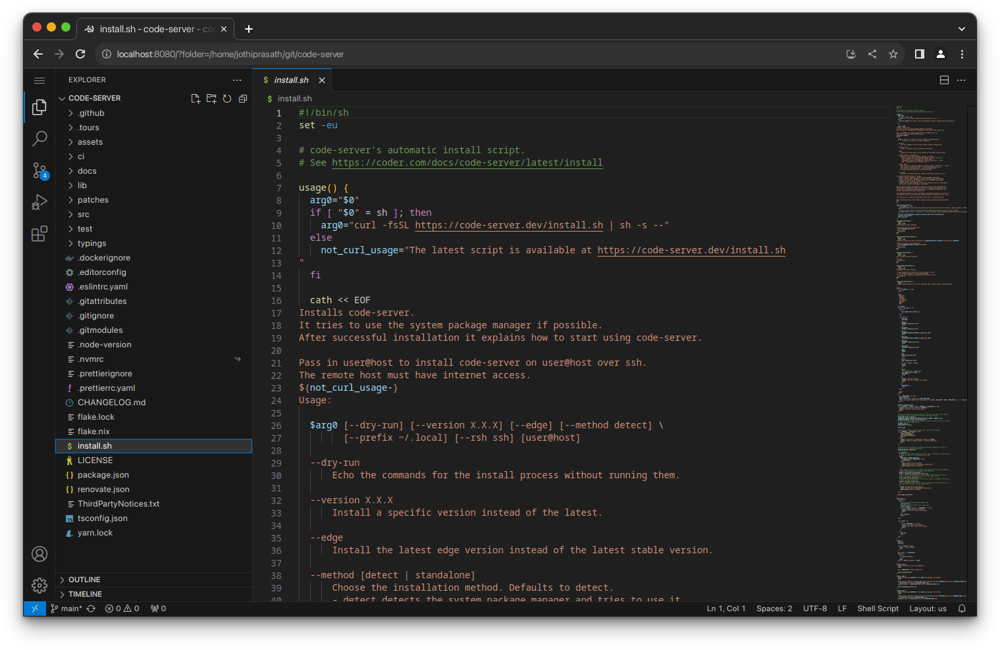

# shrinking-server

`shrinking-server` is a self-hosted browser IDE fork built on top of the `code-server` and VS Code stack. This repo packages the server, custom startup branding, default theme work, and the optional `shrinking-server-mcp` companion for AI and automation workflows.




## Why This Fork

- a branded `shrinking-server` experience instead of stock `code-server`
- installer flow that points to this repository
- optional MCP companion install during setup when `npm` is available
- room for custom defaults, themes, UI behavior, and server-side integrations

## Quick Start

Repository:
`https://github.com/xgauravyaduvanshii/shrinking-server`

Install script:
`https://raw.githubusercontent.com/xgauravyaduvanshii/shrinking-server/main/install.sh`

Preview the installer:

```bash
curl -fsSL https://raw.githubusercontent.com/xgauravyaduvanshii/shrinking-server/main/install.sh | sh -s -- --dry-run
```

Install the server:

```bash
curl -fsSL https://raw.githubusercontent.com/xgauravyaduvanshii/shrinking-server/main/install.sh | sh
```

After install, the script:

- installs `shrinking-server`
- prints the commands to start it
- installs `shrinking-server-mcp` too when `npm` is present

## What You Get

- browser-based VS Code experience hosted on your own server
- Linux-first deployment flow
- repo-based installer and branding
- optional MCP server for:
  - filesystem access
  - terminal control
  - search
  - git workflows
  - extension management
  - bridge features like native socket, LSP, and UI terminal integrations

## Requirements

- Linux machine with WebSockets enabled
- at least 1 GB RAM
- at least 2 vCPUs recommended
- `npm` installed if you want automatic `shrinking-server-mcp` setup from the installer

## Development

Build from source:

```bash
cd /home/ubuntu/flyingdarkdev-server/code-server
git submodule update --init --recursive
npm install
npm run build
```

Build MCP:

```bash
cd /home/ubuntu/flyingdarkdev-server/code-server/code-server-mcp
npm install
npm run build
```

## Docs

- Repo root overview: [README.md](/home/ubuntu/flyingdarkdev-server/code-server/README.md)
- MCP guide: [README.md](/home/ubuntu/flyingdarkdev-server/code-server/code-server-mcp/README.md)
- Installer: [install.sh](/home/ubuntu/flyingdarkdev-server/code-server/install.sh)

## Support

- Issues: `https://github.com/xgauravyaduvanshii/shrinking-server/issues`
- Pull requests: `https://github.com/xgauravyaduvanshii/shrinking-server`
